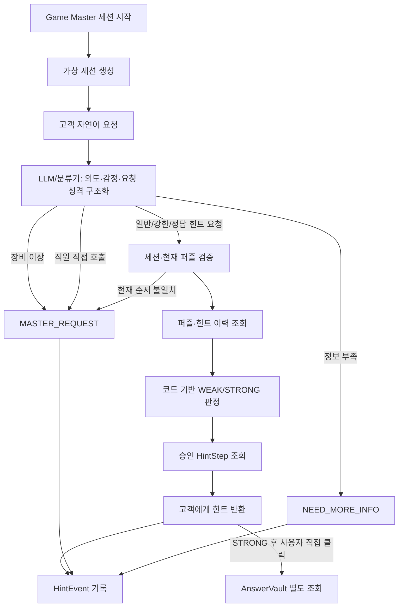

# 방탈출 Agent Workflow — 데모 확장본

## 핵심 경계

- LLM은 자연어 구조화까지만 담당한다.
- 최종 힌트 강도는 `backend/services/hint_decision.py`가 결정한다.
- 일반 힌트 경로에서 AnswerVault를 직접 읽지 않는다.
- 예외 상황은 사람을 제거하지 않고 Game Master 경로로 전환한다.
