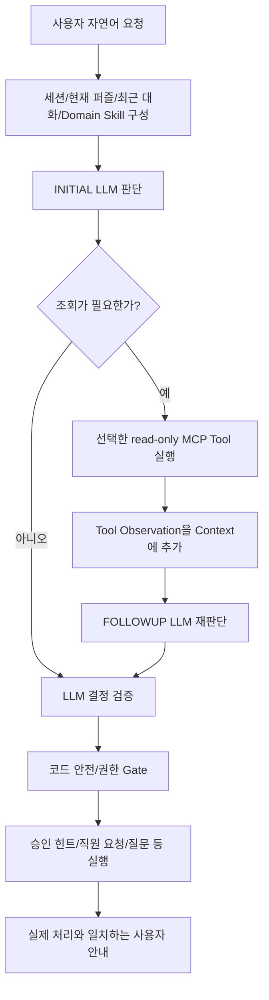

# 방탈출 운영 보조 Agent Workflow — 현재 기준

## 역할 경계

### LLM

- 사용자 의도·복합 요청 의미 판단
- 필요한 조회 Tool 선택
- 정보 부족 시 추가 질문 판단
- Domain Skill/Context/Observation을 함께 보고 `support_need`와 action 결정
- FOLLOWUP에서 조회 전 판단을 유지하거나 근거에 따라 변경

### 코드/MCP

- LLM의 도메인 적절성을 15분/50% 같은 숫자 규칙으로 다시 결정하지 않음
- 세션·권한·현재 퍼즐 검증
- 승인된 힌트만 반환
- ANSWER 별도 동의 경계
- 직원 요청 상태·멱등성
- Pydantic/Policy 계약 검증과 제한된 REPAIR

## Provider 호출

- 조회가 필요 없으면 보통 INITIAL 1회
- 조회가 필요하면 INITIAL + FOLLOWUP
- 계약 오류가 있을 때만 제한된 REPAIR 추가
- Provider 호출은 독립 요청이므로 FOLLOWUP에는 Context, previous decision, Tool results를 다시 전달한다.
